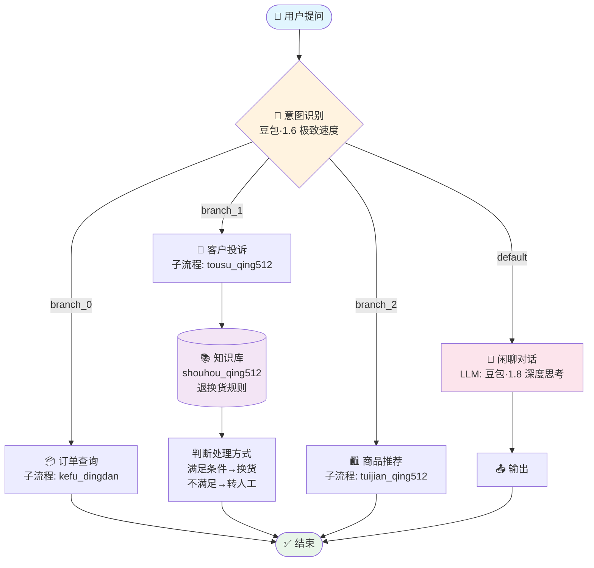

# 智能电商客服

> 退换货规则 + 智能分流

基于退换货规则，智能回答客户问题，并自动分流至退货、换货、人工客服或闲聊流程。适用于电商平台售后客服场景，降低人工成本、提升响应效率。

## 工作流架构



### 设计要点

- **意图识别分流**：4 路分支，各走各的专业子流程，避免一个大模型"全包"导致的幻觉和不可控
- **知识库驱动**：投诉处理不靠 LLM 凭空判断，而是检索退换货规则表，基于规则决策
- **性格分层**：闲聊节点用 ESFJ（友好耐心），投诉节点用专家型 Prompt（严谨专业），不同场景不同人格

## 功能特性

- 基于退换货规则自动解答客户疑问
- 智能分流：退货 / 换货 / 人工服务 / 闲聊
- 支持多轮对话与上下文理解
- 可配置的规则引擎，适配不同平台政策

## 项目结构

```
├── README.md
├── .gitignore
├── agent/
│   ├── prompt.md              # 主提示词（人设与回复逻辑）
│   └── config.yaml            # 智能体元信息
├── workflows/
│   ├── kefu_qing5_12.yaml     # 主工作流
│   ├── kefu_dingdan_qingqing512.yaml  # 订单查询子流程
│   ├── tousu_qing512.yaml     # 客户投诉子流程
│   └── tuijian_qing512.yaml   # 商品推荐子流程
└── knowledge/
    └── return-policy.md       # 退换货规则知识库
```

## 平台

基于 [Coze（扣子）](https://www.coze.com) 构建。

## 快速体验

👉 https://www.coze.cn/s/MRXPAhAouv4/
